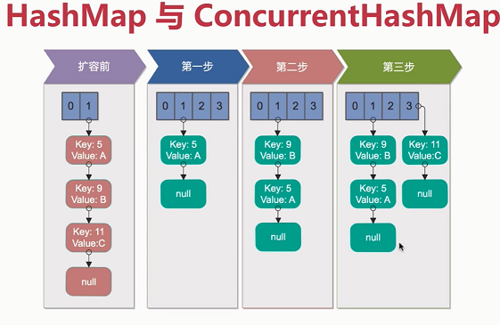

# 多线程并发

## 1. 死锁

1. 死锁的必要条件
    - 互斥
    - 占有并等待
    - 非抢占
    - 循环等待
    ```java
    // 死锁示例代码
    package com.mmall.concurrency.example.deadLock;
    
    import lombok.extern.slf4j.Slf4j;
    
    /**
     * 一个简单的死锁类
     * 当DeadLock类的对象flag==1时（td1），先锁定o1,睡眠500毫秒
     * 而td1在睡眠的时候另一个flag==0的对象（td2）线程启动，先锁定o2,睡眠500毫秒
     * td1睡眠结束后需要锁定o2才能继续执行，而此时o2已被td2锁定；
     * td2睡眠结束后需要锁定o1才能继续执行，而此时o1已被td1锁定；
     * td1、td2相互等待，都需要得到对方锁定的资源才能继续执行，从而死锁。
     */
    
    @Slf4j
    public class DeadLock implements Runnable {
        public int flag = 1;
        //静态对象是类的所有对象共享的
        private static Object o1 = new Object(), o2 = new Object();
    
        @Override
        public void run() {
            log.info("flag:{}", flag);
            if (flag == 1) {
                synchronized (o1) {
                    try {
                        Thread.sleep(500);
                    } catch (Exception e) {
                        e.printStackTrace();
                    }
                    synchronized (o2) {
                        log.info("1");
                    }
                }
            }
            if (flag == 0) {
                synchronized (o2) {
                    try {
                        Thread.sleep(500);
                    } catch (Exception e) {
                        e.printStackTrace();
                    }
                    synchronized (o1) {
                        log.info("0");
                    }
                }
            }
        }
    
        public static void main(String[] args) {
            DeadLock td1 = new DeadLock();
            DeadLock td2 = new DeadLock();
            td1.flag = 1;
            td2.flag = 0;
            //td1,td2都处于可执行状态，但JVM线程调度先执行哪个线程是不确定的。
            //td2的run()可能在td1的run()之前运行
            new Thread(td1).start();
            new Thread(td2).start();
        }
    }

    ```
1. 死锁检测
1. 死锁预防 vs. 死锁避免
    - 银行家算法

## 2. 多线程并发实践

1. 使用本地变量
2. 使用不可变类
3. 最小化锁的作用范围
4. 使用线程池的Executor
5. 尽量使用同步而不是线程wait和notify
6. 使用BlockingQueue实现消费者-生产者模式
7. 使用并发集合而不是加了锁的同步不集合
8. 使用信号量创建有界的访问
9. 使用同步代码块，不使用同步方法
10. 避免使用静态变量

## 3. Spring与线程安全

1. Spring Bean
    - Singleton
    - Prototype
1. 无状态对象
    - Dao
    - Service
    - Controller
    - ......

## HashMap与ConcurrentHashMap

1. **HashMap多线程时死循环原理**
1. HashMap与ConcurrentHashMap不同(面试)
    - 红黑树提高并发性
    
   
   
   
## 总结

        