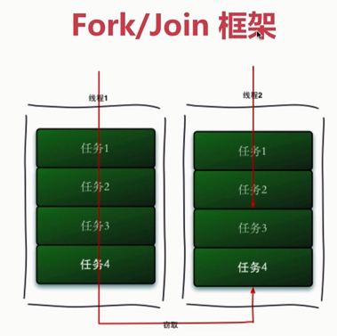
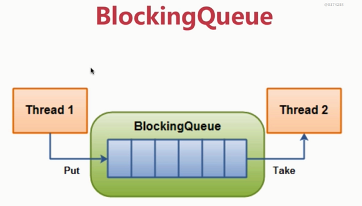

# J.U.C.组件拓展

<!-- TOC -->

- [J.U.C.组件拓展](#juc)
    - [FutureTask](#futuretask)

<!-- /TOC -->

## 1. FutureTask

1. Callable与Runnable
1. Future接口
1. FutureTask

    ```java
    public class FutureExample {
    
        static class MyCallable implements Callable<String> {
    
            @Override
            public String call() throws Exception {
                log.info("do something in callable");
                Thread.sleep(5000);
                return "Done";
            }
        }
    
        public static void main(String[] args) throws Exception {
            ExecutorService executorService = Executors.newCachedThreadPool();
            Future<String> future = executorService.submit(new MyCallable());
            log.info("do something in main");
            Thread.sleep(1000);
            String result = future.get();
            log.info("result：{}", result);
        }
    }
    
    public class FutureTaskExample {
    
        public static void main(String[] args) throws Exception {
            FutureTask<String> futureTask = new FutureTask<String>(new Callable<String>() {
                @Override
                public String call() throws Exception {
                    log.info("do something in callable");
                    Thread.sleep(5000);
                    return "Done";
                }
            });
    
            new Thread(futureTask).start();
            log.info("do something in main");
            Thread.sleep(1000);
            String result = futureTask.get();
            log.info("result：{}", result);
        }
    }
    ```
## 2. Fork/Join框架

1. 图例

    

1. 特性    
    - 工作-窃取算法
        - 充分利用线程并行计算，减少线程竞争
        - 只能使用Fork/Join进行同步操作
        - 其它优缺点
    - 双端队列

1. 代码示例
    ```java
    public class ForkJoinTaskExample extends RecursiveTask<Integer> {
    
        public static final int threshold = 2;
        private int start;
        private int end;
    
        public ForkJoinTaskExample(int start, int end) {
            this.start = start;
            this.end = end;
        }
    
        @Override
        protected Integer compute() {
            int sum = 0;
    
            //如果任务足够小就计算任务
            boolean canCompute = (end - start) <= threshold;
            if (canCompute) {
                for (int i = start; i <= end; i++) {
                    sum += i;
                }
            } else {
                // 如果任务大于阈值，就分裂成两个子任务计算
                int middle = (start + end) / 2;
                ForkJoinTaskExample leftTask = new ForkJoinTaskExample(start, middle);
                ForkJoinTaskExample rightTask = new ForkJoinTaskExample(middle + 1, end);
    
                // 执行子任务
                leftTask.fork();
                rightTask.fork();
    
                // 等待任务执行结束合并其结果
                int leftResult = leftTask.join();
                int rightResult = rightTask.join();
    
                // 合并子任务
                sum = leftResult + rightResult;
            }
            return sum;
        }
    
        public static void main(String[] args) {
            ForkJoinPool forkjoinPool = new ForkJoinPool();
    
            //生成一个计算任务，计算1+2+3+4
            ForkJoinTaskExample task = new ForkJoinTaskExample(1, 100);
    
            //执行一个任务
            Future<Integer> result = forkjoinPool.submit(task);
    
            try {
                log.info("result:{}", result.get());
            } catch (Exception e) {
                log.error("exception", e);
            }
        }
    }
    ```
    
## 3. BlockingQueue

1. 图例
    
        

1. 实现
    - ArrayBlockingQueue
    - DelayQueue
    - LinkedBlockingQueue
    - PriorityBlockingQueue(优先级队列)
    - SynchronousQueue(同步队列，无界非缓冲队列)    