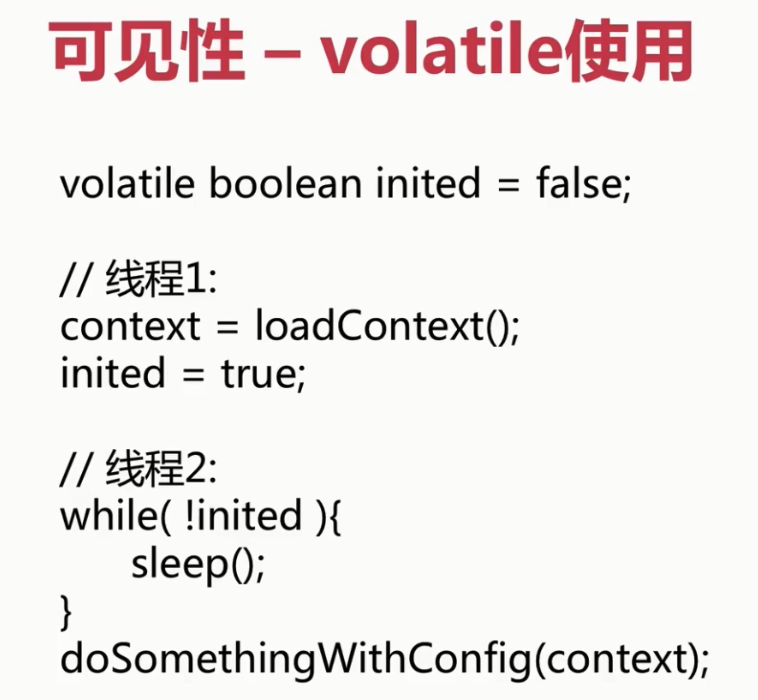
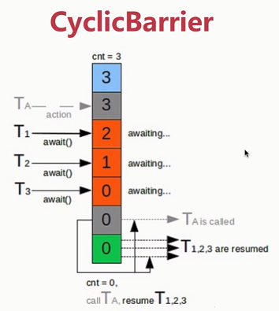

# Java高并发编程

1. 线程安全性
    1. 原子性（互斥访问）
        1. ***package atomic***
            - ***CAS原理, ABA问题(面试)***
            - 常用类
                - LongAdder
                - AtomicLong
                - AtomicReference
                - AtomicStampReference
        2. 锁
            - synchronized(同步锁)，**依赖于JVM**
                - 不可中断锁，适合竞争不激烈情况下使用，可读性好
                - 修饰对象，作用范围，作用对象
                - 修饰代码块，作用于调用对象
                - 修饰方法
                - 修饰静态方法
                - 修饰类
            - lock，**依赖于特殊的CPU指令**
                - 可中断锁，适合竞争激烈情况下使用        
    2. 可见性
        > 参考inside-jvm
        - 线程安全性
            1. 原子性：提供了互斥访问，同一时刻只能有一个线裎来对它进行操作
            1. 可见性：一个线裎对主内存的修改可以及时的被其他线裎观察到
            1. 有序性：一个线裎观察其他线裎中的指令执行顺序，由于指令重排序的存在，该观察结果一般杂乱无序
        - volatile
            - 插入指令屏障，禁用指令重排序
            - 非原子操作，不能保证线程安全性
            - 应用示例
            
                

    3. 有序性
        - 指令重排序
        - 保证有序性
            - volatile, synchronized, lock
        - happens-before原则
            - 程序次序规则
            - 锁定规则
                > 一个unlock操作先行发生于后面对同一个锁的lock操作
            - volatile变量规则
            - 传递规则
            - 线程启动规则
            - 线程中断规则
            - 线程终结规则
            - 对象终结规则
                
2. 安全发布对象
    1. 发布对象
        ```java
           @Slf4j
                   @NotThreadSafe
                   public class UnsafePublish {
                   
                       private String[] states = {"a", "b", "c"};
                   
                       public String[] getStates() {
                           return states;
                       }
                   
                       public static void main(String[] args) {
                           UnsafePublish unsafePublish = new UnsafePublish();
                           log.info("{}", Arrays.toString(unsafePublish.getStates()));
                   
                           // 对私有属性进行修改，线程不安全
                           unsafePublish.getStates()[0] = "d";
                           log.info("{}", Arrays.toString(unsafePublish.getStates()));
                       }
                   }
        ```
    1. 发布对象逸出
        - this指针逸出
        > 对象未完成构造之前不能发布
    - **单例模式**
        ```java
           @Slf4j
           @NotThreadSafe
           @NotRecommend
           public class Escape {
           
               private int thisCanBeEscape = 0;
           
               public Escape () {
                   new InnerClass();
               }
           
               private class InnerClass {
           
                   public InnerClass() {
                       log.info("{}", Escape.this.thisCanBeEscape);
                   }
               }
           
               public static void main(String[] args) {
                   new Escape();
               }
           }
        ```
    1. 安全发布对象        
        1. 令在静态初始化函数中初始化一个对象引用
        1. 令将对象的引用保存到volatile类型域或者AtomicReference对象中
        1. 令将对象的引用保存到某个正确构造对象的fina|类型域中
        1. 令将对象的引用保存到一个由锁保护的域中
            ```java
            /**
             * 懒汉模式
             * 单例实例在第一次使用时进行创建
             */
            @NotThreadSafe
            public class SingletonExample1 {
                // 私有构造函数
                private SingletonExample1() {
                }
                // 单例对象
                private static SingletonExample1 instance = null;
                // 静态的工厂方法
                public static SingletonExample1 getInstance() {
                    if (instance == null) {
                        instance = new SingletonExample1();
                    }
                    return instance;
                }
            }
 
            /**
             * 饿汉模式
             * 单例实例在类装载时进行创建
             */
            @ThreadSafe
            public class SingletonExample2 {
            
                // 私有构造函数
                private SingletonExample2() {
            
                }
            
                // 单例对象
                private static SingletonExample2 instance = new SingletonExample2();
            
                // 静态的工厂方法
                public static SingletonExample2 getInstance() {
                    return instance;
                }
            }
 
            /**
             * 懒汉模式
             * 单例实例在第一次使用时进行创建
             */
            @ThreadSafe
            @NotRecommend
            public class SingletonExample3 {
            
                // 私有构造函数
                private SingletonExample3() {
            
                }
            
                // 单例对象
                private static SingletonExample3 instance = null;
            
                // 静态的工厂方法
                // synchronized 性能开销较大
                public static synchronized SingletonExample3 getInstance() {
                    if (instance == null) {
                        instance = new SingletonExample3();
                    }
                    return instance;
                }
            }
 
            /**
             * 懒汉模式 -》 双重同步锁单例模式
             * 单例实例在第一次使用时进行创建
             * 线程不安全
             */
            @NotThreadSafe
            public class SingletonExample4 {
            
                // 私有构造函数
                private SingletonExample4() {
            
                }
            
                // 1、memory = allocate() 分配对象的内存空间
                // 2、ctorInstance() 初始化对象
                // 3、instance = memory 设置instance指向刚分配的内存
            
                // JVM和cpu优化，发生了指令重排
            
                // 1、memory = allocate() 分配对象的内存空间
                // 3、instance = memory 设置instance指向刚分配的内存
                // 2、ctorInstance() 初始化对象
            
                // 单例对象
                private static SingletonExample4 instance = null;
            
                // 静态的工厂方法
                // 单例对象 volatile + 双重检测机制 -> 禁止指令重排
                public volatile static SingletonExample4 getInstance() {
                    if (instance == null) { // 双重检测机制        // B
                        synchronized (SingletonExample4.class) { // 同步锁
                            if (instance == null) {
                                instance = new SingletonExample4(); // A - 3
                            }
                        }
                    }
                    return instance;
                }
            }
            
            /**
             * 饿汉模式
             * 单例实例在类装载时进行创建
             */
            @ThreadSafe
            public class SingletonExample6 {
            
                // 私有构造函数
                private SingletonExample6() {
            
                }
            
                // 单例对象
                private static SingletonExample6 instance = null;
            
                // 注意静态块的顺序
                static {
                    instance = new SingletonExample6();
                }
            
                // 静态的工厂方法
                public static SingletonExample6 getInstance() {
                    return instance;
                }
            
                public static void main(String[] args) {
                    System.out.println(getInstance().hashCode());
                    System.out.println(getInstance().hashCode());
                }
            }
 
            /**
             * 枚举模式：最安全
             */
            @ThreadSafe
            @Recommend
            public class SingletonExample7 {
            
                // 私有构造函数
                private SingletonExample7() {
            
                }
            
                public static SingletonExample7 getInstance() {
                    return Singleton.INSTANCE.getInstance();
                }
            
                private enum Singleton {
                    INSTANCE;
            
                    private SingletonExample7 singleton;
            
                    // JVM保证这个方法绝对只调用一次
                    Singleton() {
                        singleton = new SingletonExample7();
                    }
            
                    public SingletonExample7 getInstance() {
                        return singleton;
                    }
                }
            }
            ```
1. 不可变对象
    1. final关键字：类，方法，变量
        1. 修饰方法
            - 锁定方法不被继承类修改
            - 效率
        1. 修饰变量
            - 基本数据类型 引用类型
            - 修饰函数参数后，不能在函数内部再修改该参数的值
    1. Collections
        ```java
        @Slf4j
        @ThreadSafe
        public class ImmutableExample2 {
        
            private static Map<Integer, Integer> map = Maps.newHashMap();
        
            static {
                map.put(1, 2);
                map.put(3, 4);
                map.put(5, 6);
                map = Collections.unmodifiableMap(map);
            }
        
            public static void main(String[] args) {
                map.put(1, 3);
                log.info("{}", map.get(1));
            }
        
        }
        ```
    1. Guava
        ```java
        package com.mmall.concurrency.example.immutable;
        
        import com.google.common.collect.ImmutableList;
        import com.google.common.collect.ImmutableMap;
        import com.google.common.collect.ImmutableSet;
        import com.mmall.concurrency.annoations.ThreadSafe;
        
        @ThreadSafe
        public class ImmutableExample3 {
        
            private final static ImmutableList<Integer> list = ImmutableList.of(1, 2, 3);
        
            private final static ImmutableSet set = ImmutableSet.copyOf(list);
        
            private final static ImmutableMap<Integer, Integer> map = ImmutableMap.of(1, 2, 3, 4);
        
            private final static ImmutableMap<Integer, Integer> map2 = ImmutableMap.<Integer, Integer>builder()
                    .put(1, 2).put(3, 4).put(5, 6).build();
        
        
            public static void main(String[] args) {
                System.out.println(map2.get(3));
            }
        }

        ```
1. 线程封闭
    - ThreadLocal
        - SpringBoot中过滤器、拦截器的编写。
    1. ad-hoc封闭：程序控制实现，不推荐
    1. 堆栈封闭：局部变量，无并发问题
        > <a href="https://github.com/GaoYong0520/inside-jvm/blob/master/jvm/Notes/JVM%E5%86%85%E5%AD%98%E5%88%92%E5%88%86.md">参考Java内存模型 </a>
    1. **ThreadLocal线程封闭**
        - 深入学习
1. 线程不安全类与写法
    - StringBuilder vs StringBuffer
        - StringBuilder
            - 线程不安全
        - StringBuffer
            - 使用synchronized修饰，线程安全，但是性能消耗较高
    - DateFormat
    - HashMap，HashSet，ArrayList等Collection类
    - 先检查再执行
        - 存在非原子操作，容易导致线程不安全发生
        
## 线程安全——同步容器
1. Vector, Stack
    ```java
    @ThreadSafe
    public class VectorExample1 {
    
        // 请求总数
        public static int clientTotal = 5000;
    
        // 同时并发执行的线程数
        public static int threadTotal = 200;
    
        private static List<Integer> list = new Vector<>();
    
        public static void main(String[] args) throws Exception {
            ExecutorService executorService = Executors.newCachedThreadPool();
            final Semaphore semaphore = new Semaphore(threadTotal);
            final CountDownLatch countDownLatch = new CountDownLatch(clientTotal);
            for (int i = 0; i < clientTotal; i++) {
                final int count = i;
                executorService.execute(() -> {
                    try {
                        semaphore.acquire();
                        update(count);
                        semaphore.release();
                    } catch (Exception e) {
                        log.error("exception", e);
                    }
                    countDownLatch.countDown();
                });
            }
            countDownLatch.await();
            executorService.shutdown();
            log.info("size:{}", list.size());
        }
    
        private static void update(int i) {
            list.add(i);
        }
    }
    //线程不安全
    @NotThreadSafe
    public class VectorExample2 {
    
        private static Vector<Integer> vector = new Vector<>();
    
        public static void main(String[] args) {
    
            while (true) {
    
                for (int i = 0; i < 10; i++) {
                    vector.add(i);
                }
    
                Thread thread1 = new Thread() {
                    public void run() {
                        for (int i = 0; i < vector.size(); i++) {
                            vector.remove(i);
                        }
                    }
                };
    
                Thread thread2 = new Thread() {
                    public void run() {
                        for (int i = 0; i < vector.size(); i++) {
                            vector.get(i);
                        }
                    }
                };
                thread1.start();
                thread2.start();
            }
        }
    }
 
    // 在遍历过程中不要对容器内容进行修改
    public class VectorExample3 {
    
        // java.util.ConcurrentModificationException
        private static void test1(Vector<Integer> v1) { // foreach
            for(Integer i : v1) {
                if (i.equals(3)) {
                    v1.remove(i);
                }
            }
        }
    
        // java.util.ConcurrentModificationException
        private static void test2(Vector<Integer> v1) { // iterator
            Iterator<Integer> iterator = v1.iterator();
            while (iterator.hasNext()) {
                Integer i = iterator.next();
                if (i.equals(3)) {
                    v1.remove(i);
                }
            }
        }
    
        // success
        private static void test3(Vector<Integer> v1) { // for
            for (int i = 0; i < v1.size(); i++) {
                if (v1.get(i).equals(3)) {
                    v1.remove(i);
                }
            }
        }
    
        public static void main(String[] args) {
    
            Vector<Integer> vector = new Vector<>();
            vector.add(1);
            vector.add(2);
            vector.add(3);
            test1(vector);
        }
    }
    ```
1. HashTable(key, value不能为null)
    ```java
    @ThreadSafe
    public class HashTableExample {
    
        // 请求总数
        public static int clientTotal = 5000;
    
        // 同时并发执行的线程数
        public static int threadTotal = 200;
    
        private static Map<Integer, Integer> map = new Hashtable<>();
    
        public static void main(String[] args) throws Exception {
            ExecutorService executorService = Executors.newCachedThreadPool();
            final Semaphore semaphore = new Semaphore(threadTotal);
            final CountDownLatch countDownLatch = new CountDownLatch(clientTotal);
            for (int i = 0; i < clientTotal; i++) {
                final int count = i;
                executorService.execute(() -> {
                    try {
                        semaphore.acquire();
                        update(count);
                        semaphore.release();
                    } catch (Exception e) {
                        log.error("exception", e);
                    }
                    countDownLatch.countDown();
                });
            }
            countDownLatch.await();
            executorService.shutdown();
            log.info("size:{}", map.size());
        }
    
        private static void update(int i) {
            map.put(i, i);
        }
    }
    ```
1. Collections.synchronizedXXX(List, Set, Map)
    ```java
    @ThreadSafe
    public class CollectionsExample1 {
    
        // 请求总数
        public static int clientTotal = 5000;
    
        // 同时并发执行的线程数
        public static int threadTotal = 200;
    
        private static List<Integer> list = Collections.synchronizedList(Lists.newArrayList());
    
        public static void main(String[] args) throws Exception {
            ExecutorService executorService = Executors.newCachedThreadPool();
            final Semaphore semaphore = new Semaphore(threadTotal);
            final CountDownLatch countDownLatch = new CountDownLatch(clientTotal);
            for (int i = 0; i < clientTotal; i++) {
                final int count = i;
                executorService.execute(() -> {
                    try {
                        semaphore.acquire();
                        update(count);
                        semaphore.release();
                    } catch (Exception e) {
                        log.error("exception", e);
                    }
                    countDownLatch.countDown();
                });
            }
            countDownLatch.await();
            executorService.shutdown();
            log.info("size:{}", list.size());
        }
    
        private static void update(int i) {
            list.add(i);
        }
    }
    ```

## 并发容器J.U.C

1. ArrayList -> CopyOnWriteArrayList
    - 实时性不好，对性能开销较大
    - 适合读多写少的操作
    - 线程安全
    - 读写分离
        - 读不加锁，写加锁
    ```java
    @ThreadSafe
    public class CopyOnWriteArrayListExample {
    
        // 请求总数
        public static int clientTotal = 5000;
    
        // 同时并发执行的线程数
        public static int threadTotal = 200;
    
        private static List<Integer> list = new CopyOnWriteArrayList<>();
    
        public static void main(String[] args) throws Exception {
            ExecutorService executorService = Executors.newCachedThreadPool();
            final Semaphore semaphore = new Semaphore(threadTotal);
            final CountDownLatch countDownLatch = new CountDownLatch(clientTotal);
            for (int i = 0; i < clientTotal; i++) {
                final int count = i;
                executorService.execute(() -> {
                    try {
                        semaphore.acquire();
                        update(count);
                        semaphore.release();
                    } catch (Exception e) {
                        log.error("exception", e);
                    }
                    countDownLatch.countDown();
                });
            }
            countDownLatch.await();
            executorService.shutdown();
            log.info("size:{}", list.size());
        }
    
        private static void update(int i) {
            list.add(i);
        }
    }
    ``` 
1. HashSet, TreeSet => CopyOnWriteArraySet, ConcurrentSkipListSet
1. HashMap, TreeMap => **ConcurrentHashMap, ConcurrentSkipListMap**
    - 面试
    
    
## AQS

1. 基础概念
    - 使用双向链表，使用Node实现FIFO队列
    - ......
1. CountDownLatch
    ```java
    public class CountDownLatchExample1 {
    
        private final static int threadCount = 200;
    
        public static void main(String[] args) throws Exception {
    
            ExecutorService exec = Executors.newCachedThreadPool();
    
            final CountDownLatch countDownLatch = new CountDownLatch(threadCount);
    
            for (int i = 0; i < threadCount; i++) {
                final int threadNum = i;
                exec.execute(() -> {
                    try {
                        test(threadNum);
                    } catch (Exception e) {
                        log.error("exception", e);
                    } finally { //注意异常情况
                        countDownLatch.countDown();
                    }
                });
            }
            //保证之前的线程全部执行完毕
            //计数器+等待时间
            countDownLatch.await();
            log.info("finish");
            //关闭线程池， 线程执行完毕后释放资源
            exec.shutdown();
        }
    
        private static void test(int threadNum) throws Exception {
            Thread.sleep(100);
            log.info("{}", threadNum);
            Thread.sleep(100);
        }
    }
    ```
1. Semaphore(信号量)
    > 参考操作系统信号量概念
    ```java
    public class SemaphoreExample1 {
    
        private final static int threadCount = 20;
    
        public static void main(String[] args) throws Exception {
    
            ExecutorService exec = Executors.newCachedThreadPool();
    
            // 3——允许的并发数
            final Semaphore semaphore = new Semaphore(3);
    
            for (int i = 0; i < threadCount; i++) {
                final int threadNum = i;
                exec.execute(() -> {
                    try {
                        semaphore.acquire(); // 获取一个许可，也可以获取多个许可
                        test(threadNum);
                        semaphore.release(); // 释放一个许可，也可以释放多个许可
                    } catch (Exception e) {
                        log.error("exception", e);
                    }
                });
            }
            exec.shutdown();
        }
    
        private static void test(int threadNum) throws Exception {
            log.info("{}", threadNum);
            Thread.sleep(1000);
        }
    }
 
    public class SemaphoreExample4 {
    
        private final static int threadCount = 20;
    
        public static void main(String[] args) throws Exception {
    
            ExecutorService exec = Executors.newCachedThreadPool();
    
            final Semaphore semaphore = new Semaphore(5);
    
            for (int i = 0; i < threadCount; i++) {
                final int threadNum = i;
                exec.execute(() -> {
                    try {
                        if (semaphore.tryAcquire(5000, TimeUnit.MILLISECONDS)) { // 尝试获取一个许可
                            test(threadNum);
                            semaphore.release(); // 释放一个许可
                        }
                    } catch (Exception e) {
                        log.error("exception", e);
                    }
                });
            }
            exec.shutdown();
        }
    
        private static void test(int threadNum) throws Exception {
            log.info("{}", threadNum);
            Thread.sleep(1000);
        }
    }
    ``` 
1.  CyclicBarrier
    - 原理图
        
        
        
    - 计数器
    - 对比CountDownLatch
    - 用途：多个线程之间相互等待
    
    ```java
    public class CyclicBarrierExample2 {
    
        private static CyclicBarrier barrier = new CyclicBarrier(5);
    
        public static void main(String[] args) throws Exception {
    
            ExecutorService executor = Executors.newCachedThreadPool();
    
            for (int i = 0; i < 10; i++) {
                final int threadNum = i;
                Thread.sleep(1000);
                executor.execute(() -> {
                    try {
                        race(threadNum);
                    } catch (Exception e) {
                        log.error("exception", e);
                    }
                });
            }
            executor.shutdown();
        }
    
        private static void race(int threadNum) throws Exception {
            Thread.sleep(1000);
            log.info("{} is ready", threadNum);
            try {
                // 等待超时后，发生异常，根据需要捕捉异常
                barrier.await(2000, TimeUnit.MILLISECONDS);
            } catch (Exception e) {
                log.warn("BarrierException", e);
            }
            log.info("{} continue", threadNum);
        }
    }
    ```      
1. ReentrantLock(可重入锁)与锁
    - 基本概念
        - Java锁
            1. synchronized——JVM实现
                - ***synchronized自旋锁***
            1. ReentrantLock——JDK实现
            1. 对比：
                - 可重入锁
                - 实现
                - 性能
            1. 功能
                - ReentrantLock独有功能
                
                    > 尽量减少线程进入内核态，使操作在用户态完成
                    - 可指定公平锁或非公平锁
                    - 提供Condition类，分组唤醒需要唤醒的锁
                    - 提供能够中断等待锁的线程的机制                   
    1.  **ReentrantReadWriteLock**
   
        > 在没有读锁和写锁时才能进行写入操作，使用悲观读取。**读多写少的时候可能会导致线程饥饿**
    
    1.  **StampedLock**
       
    ```java
    public class LockExample2 {
    
        // 请求总数
        public static int clientTotal = 5000;
    
        // 同时并发执行的线程数
        public static int threadTotal = 200;
    
        public static int count = 0;
    
        private final static Lock lock = new ReentrantLock();
    
        public static void main(String[] args) throws Exception {
            ExecutorService executorService = Executors.newCachedThreadPool();
            final Semaphore semaphore = new Semaphore(threadTotal);
            final CountDownLatch countDownLatch = new CountDownLatch(clientTotal);
            for (int i = 0; i < clientTotal ; i++) {
                executorService.execute(() -> {
                    try {
                        semaphore.acquire();
                        add();
                        semaphore.release();
                    } catch (Exception e) {
                        log.error("exception", e);
                    }
                    countDownLatch.countDown();
                });
            }
            countDownLatch.await();
            executorService.shutdown();
            log.info("count:{}", count);
        }
    
        private static void add() {
            lock.lock();
            try {
                count++;
            } finally { //在finally块中释放锁
                lock.unlock();
            }
        }
    }
 
    public class LockExample3 {
    
        private final Map<String, Data> map = new TreeMap<>();
        //在没有读锁和写锁时才能进行写入操作，使用悲观读取
        private final ReentrantReadWriteLock lock = new ReentrantReadWriteLock();
    
        private final Lock readLock = lock.readLock();
    
        private final Lock writeLock = lock.writeLock();
    
        public Data get(String key) {
            readLock.lock();
            try {
                return map.get(key);
            } finally {
                readLock.unlock();
            }
        }
    
        public Set<String> getAllKeys() {
            readLock.lock();
            try {
                return map.keySet();
            } finally {
                readLock.unlock();
            }
        }
    
        public Data put(String key, Data value) {
            writeLock.lock();
            try {
                return map.put(key, value);
            } finally {
                readLock.unlock();
            }
        }
    
        class Data {
    
        }
        
        // StampedLock
        public class LockExample4 {
        
            class Point {
                private double x, y;
                private final StampedLock sl = new StampedLock();
        
                void move(double deltaX, double deltaY) { // an exclusively locked method
                    long stamp = sl.writeLock();
                    try {
                        x += deltaX;
                        y += deltaY;
                    } finally {
                        sl.unlockWrite(stamp);
                    }
                }
        
                //下面看看乐观读锁案例
                double distanceFromOrigin() { // A read-only method
                    long stamp = sl.tryOptimisticRead(); //获得一个乐观读锁
                    double currentX = x, currentY = y;  //将两个字段读入本地局部变量
                    if (!sl.validate(stamp)) { //检查发出乐观读锁后同时是否有其他写锁发生？
                        stamp = sl.readLock();  //如果没有，我们再次获得一个读悲观锁
                        try {
                            currentX = x; // 将两个字段读入本地局部变量
                            currentY = y; // 将两个字段读入本地局部变量
                        } finally {
                            sl.unlockRead(stamp);
                        }
                    }
                    return Math.sqrt(currentX * currentX + currentY * currentY);
                }
        
                //下面是悲观读锁案例
                void moveIfAtOrigin(double newX, double newY) { // upgrade
                    // Could instead start with optimistic, not read mode
                    long stamp = sl.readLock();
                    try {
                        while (x == 0.0 && y == 0.0) { //循环，检查当前状态是否符合
                            long ws = sl.tryConvertToWriteLock(stamp); //将读锁转为写锁
                            if (ws != 0L) { //这是确认转为写锁是否成功
                                stamp = ws; //如果成功 替换票据
                                x = newX; //进行状态改变
                                y = newY;  //进行状态改变
                                break;
                            } else { //如果不能成功转换为写锁
                                sl.unlockRead(stamp);  //我们显式释放读锁
                                stamp = sl.writeLock();  //显式直接进行写锁 然后再通过循环再试
                            }
                        }
                    } finally {
                        sl.unlock(stamp); //释放读锁或写锁
                    }
                }
            }
        }
     
        public class LockExample5 {
        
            // 请求总数
            public static int clientTotal = 5000;
        
            // 同时并发执行的线程数
            public static int threadTotal = 200;
        
            public static int count = 0;
        
            private final static StampedLock lock = new StampedLock();
        
            public static void main(String[] args) throws Exception {
                ExecutorService executorService = Executors.newCachedThreadPool();
                final Semaphore semaphore = new Semaphore(threadTotal);
                final CountDownLatch countDownLatch = new CountDownLatch(clientTotal);
                for (int i = 0; i < clientTotal ; i++) {
                    executorService.execute(() -> {
                        try {
                            semaphore.acquire();
                            add();
                            semaphore.release();
                        } catch (Exception e) {
                            log.error("exception", e);
                        }
                        countDownLatch.countDown();
                    });
                }
                countDownLatch.await();
                executorService.shutdown();
                log.info("count:{}", count);
            }
        
            private static void add() {
                long stamp = lock.writeLock();
                try {
                    count++;
                } finally {
                    lock.unlock(stamp);
                }
            }
        }
        // 根据具体应用场景选择合适的锁
    ```       
    > 根据具体应用场景选择合适的锁    
                             