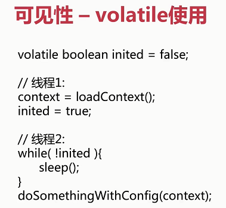

# Java高并发编程

1. 线程安全性
    1. 原子性（互斥访问）
        1. ***package atomic***
            - ***CAS原理, ABA问题(面试)***
            - 常用类
                - LongAdder
                - AtomicLong
                - AtomicReference
                - AtomicStampReference
        2. 锁
            - synchronized(同步锁)，**依赖于JVM**
                - 不可中断锁，适合竞争不激烈情况下使用，可读性好
                - 修饰对象，作用范围，作用对象
                - 修饰代码块，作用于调用对象
                - 修饰方法
                - 修饰静态方法
                - 修饰类
            - lock，**依赖于特殊的CPU指令**
                - 可中断锁，适合竞争激烈情况下使用        
    2. 可见性
        > 参考inside-jvm
        - 线程安全性
            1. 原子性：提供了互斥访问，同一时刻只能有一个线裎来对它进行操作
            1. 可见性：一个线裎对主内存的修改可以及时的被其他线裎观察到
            1. 有序性：一个线裎观察其他线裎中的指令执行顺序，由于指令重排序的存在，该观察结果一般杂乱无序
        - volatile
            - 插入指令屏障，禁用指令重排序
            - 非原子操作，不能保证线程安全性
            - 应用示例
            
                

    3. 有序性
        - 指令重排序
        - 保证有序性
            - volatile, synchronized, lock
        - happens-before原则
            - 程序次序规则
            - 锁定规则
                > 一个unlock操作先行发生于后面对同一个锁的lock操作
            - volatile变量规则
            - 传递规则
            - 线程启动规则
            - 线程中断规则
            - 线程终结规则
            - 对象终结规则
                
2. 安全发布对象
    1. 发布对象
        ```java
           @Slf4j
                   @NotThreadSafe
                   public class UnsafePublish {
                   
                       private String[] states = {"a", "b", "c"};
                   
                       public String[] getStates() {
                           return states;
                       }
                   
                       public static void main(String[] args) {
                           UnsafePublish unsafePublish = new UnsafePublish();
                           log.info("{}", Arrays.toString(unsafePublish.getStates()));
                   
                           // 对私有属性进行修改，线程不安全
                           unsafePublish.getStates()[0] = "d";
                           log.info("{}", Arrays.toString(unsafePublish.getStates()));
                       }
                   }
        ```
    1. 发布对象逸出
        - this指针逸出
        > 对象未完成构造之前不能发布
    - **单例模式**
        ```java
           @Slf4j
           @NotThreadSafe
           @NotRecommend
           public class Escape {
           
               private int thisCanBeEscape = 0;
           
               public Escape () {
                   new InnerClass();
               }
           
               private class InnerClass {
           
                   public InnerClass() {
                       log.info("{}", Escape.this.thisCanBeEscape);
                   }
               }
           
               public static void main(String[] args) {
                   new Escape();
               }
           }
        ```
    1. 安全发布对象        
        1. 令在静态初始化函数中初始化一个对象引用
        1. 令将对象的引用保存到volatile类型域或者AtomicReference对象中
        1. 令将对象的引用保存到某个正确构造对象的fina|类型域中
        1. 令将对象的引用保存到一个由锁保护的域中
            ```java
            /**
             * 懒汉模式
             * 单例实例在第一次使用时进行创建
             */
            @NotThreadSafe
            public class SingletonExample1 {
                // 私有构造函数
                private SingletonExample1() {
                }
                // 单例对象
                private static SingletonExample1 instance = null;
                // 静态的工厂方法
                public static SingletonExample1 getInstance() {
                    if (instance == null) {
                        instance = new SingletonExample1();
                    }
                    return instance;
                }
            }
 
            /**
             * 饿汉模式
             * 单例实例在类装载时进行创建
             */
            @ThreadSafe
            public class SingletonExample2 {
            
                // 私有构造函数
                private SingletonExample2() {
            
                }
            
                // 单例对象
                private static SingletonExample2 instance = new SingletonExample2();
            
                // 静态的工厂方法
                public static SingletonExample2 getInstance() {
                    return instance;
                }
            }
 
            /**
             * 懒汉模式
             * 单例实例在第一次使用时进行创建
             */
            @ThreadSafe
            @NotRecommend
            public class SingletonExample3 {
            
                // 私有构造函数
                private SingletonExample3() {
            
                }
            
                // 单例对象
                private static SingletonExample3 instance = null;
            
                // 静态的工厂方法
                // synchronized 性能开销较大
                public static synchronized SingletonExample3 getInstance() {
                    if (instance == null) {
                        instance = new SingletonExample3();
                    }
                    return instance;
                }
            }
 
            /**
             * 懒汉模式 -》 双重同步锁单例模式
             * 单例实例在第一次使用时进行创建
             * 线程不安全
             */
            @NotThreadSafe
            public class SingletonExample4 {
            
                // 私有构造函数
                private SingletonExample4() {
            
                }
            
                // 1、memory = allocate() 分配对象的内存空间
                // 2、ctorInstance() 初始化对象
                // 3、instance = memory 设置instance指向刚分配的内存
            
                // JVM和cpu优化，发生了指令重排
            
                // 1、memory = allocate() 分配对象的内存空间
                // 3、instance = memory 设置instance指向刚分配的内存
                // 2、ctorInstance() 初始化对象
            
                // 单例对象
                private static SingletonExample4 instance = null;
            
                // 静态的工厂方法
                // 单例对象 volatile + 双重检测机制 -> 禁止指令重排
                public volatile static SingletonExample4 getInstance() {
                    if (instance == null) { // 双重检测机制        // B
                        synchronized (SingletonExample4.class) { // 同步锁
                            if (instance == null) {
                                instance = new SingletonExample4(); // A - 3
                            }
                        }
                    }
                    return instance;
                }
            }
            
            /**
             * 饿汉模式
             * 单例实例在类装载时进行创建
             */
            @ThreadSafe
            public class SingletonExample6 {
            
                // 私有构造函数
                private SingletonExample6() {
            
                }
            
                // 单例对象
                private static SingletonExample6 instance = null;
            
                // 注意静态块的顺序
                static {
                    instance = new SingletonExample6();
                }
            
                // 静态的工厂方法
                public static SingletonExample6 getInstance() {
                    return instance;
                }
            
                public static void main(String[] args) {
                    System.out.println(getInstance().hashCode());
                    System.out.println(getInstance().hashCode());
                }
            }
 
            /**
             * 枚举模式：最安全
             */
            @ThreadSafe
            @Recommend
            public class SingletonExample7 {
            
                // 私有构造函数
                private SingletonExample7() {
            
                }
            
                public static SingletonExample7 getInstance() {
                    return Singleton.INSTANCE.getInstance();
                }
            
                private enum Singleton {
                    INSTANCE;
            
                    private SingletonExample7 singleton;
            
                    // JVM保证这个方法绝对只调用一次
                    Singleton() {
                        singleton = new SingletonExample7();
                    }
            
                    public SingletonExample7 getInstance() {
                        return singleton;
                    }
                }
            }
            ```
1. 不可变对象
    1. final关键字：类，方法，变量
        1. 修饰方法
            - 锁定方法不被继承类修改
            - 效率
        1. 修饰变量
            - 基本数据类型 引用类型
            - 修饰函数参数后，不能在函数内部再修改该参数的值
    1. Collections
        ```java
        @Slf4j
        @ThreadSafe
        public class ImmutableExample2 {
        
            private static Map<Integer, Integer> map = Maps.newHashMap();
        
            static {
                map.put(1, 2);
                map.put(3, 4);
                map.put(5, 6);
                map = Collections.unmodifiableMap(map);
            }
        
            public static void main(String[] args) {
                map.put(1, 3);
                log.info("{}", map.get(1));
            }
        
        }
        ```
    1. Guava
        ```java
        package com.mmall.concurrency.example.immutable;
        
        import com.google.common.collect.ImmutableList;
        import com.google.common.collect.ImmutableMap;
        import com.google.common.collect.ImmutableSet;
        import com.mmall.concurrency.annoations.ThreadSafe;
        
        @ThreadSafe
        public class ImmutableExample3 {
        
            private final static ImmutableList<Integer> list = ImmutableList.of(1, 2, 3);
        
            private final static ImmutableSet set = ImmutableSet.copyOf(list);
        
            private final static ImmutableMap<Integer, Integer> map = ImmutableMap.of(1, 2, 3, 4);
        
            private final static ImmutableMap<Integer, Integer> map2 = ImmutableMap.<Integer, Integer>builder()
                    .put(1, 2).put(3, 4).put(5, 6).build();
        
        
            public static void main(String[] args) {
                System.out.println(map2.get(3));
            }
        }

        ```                        